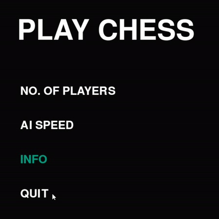
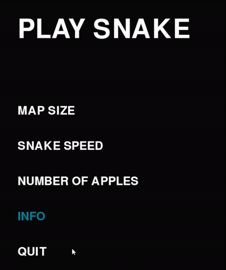
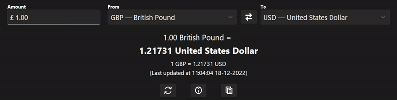
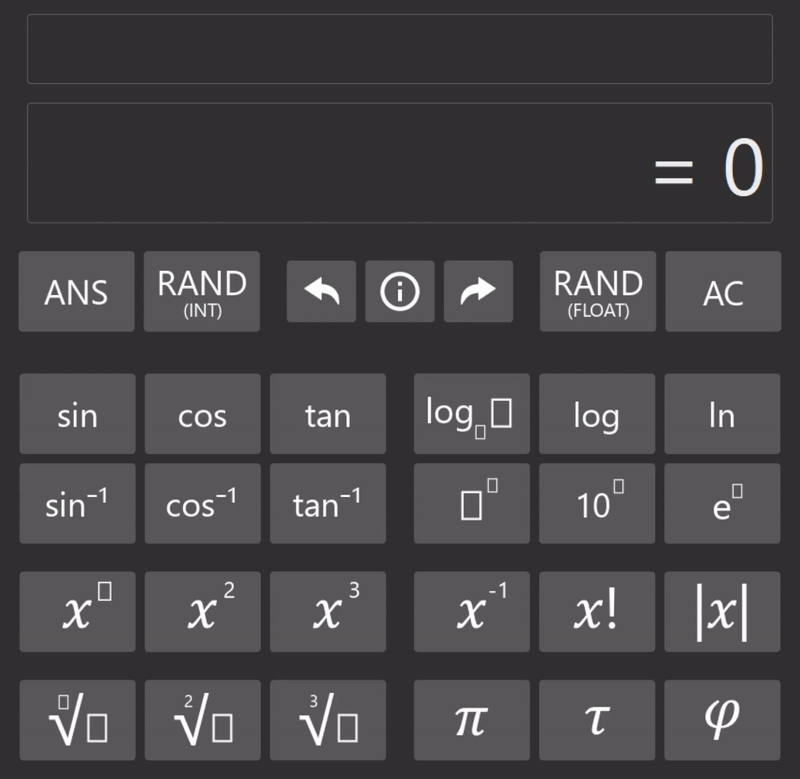

# Python Projects

## About

An assortment of projects that I undertook in order to learn Python:

Using Pygame:

* Chess
* Snake

Using Tkinter

* Currency Converter
* Calculator

## Building [](https://github.com/J-Afzal/Python-Projects/actions/workflows/pyinstaller.yml)

Using the following commands, from the root directory, to build the dev environment:

```cmd
virtualenv env
```

```cmd
env/Scripts/activate
```

```cmd
pip install -r requirements.txt
```

To compile each project into a single .exe file using the following commands from the root directory:

```cmd
cd .\.pyinstaller\ 
```

```cmd
pyinstaller build.spec
```

The .exe files should be located in `.pyinstaller/dist/`

## Warning

Due to the use of StockFish as the chess engine, a terminal window will pop up when running `Chess`.

## Chess GIF

<p align="center">
  
</p>

## Snake GIF

<p align="center">
  
</p>

## Currency Converter GIF

<p align="center">
  
</p>

## Calculator GIF

<p align="center">
  
</p>
