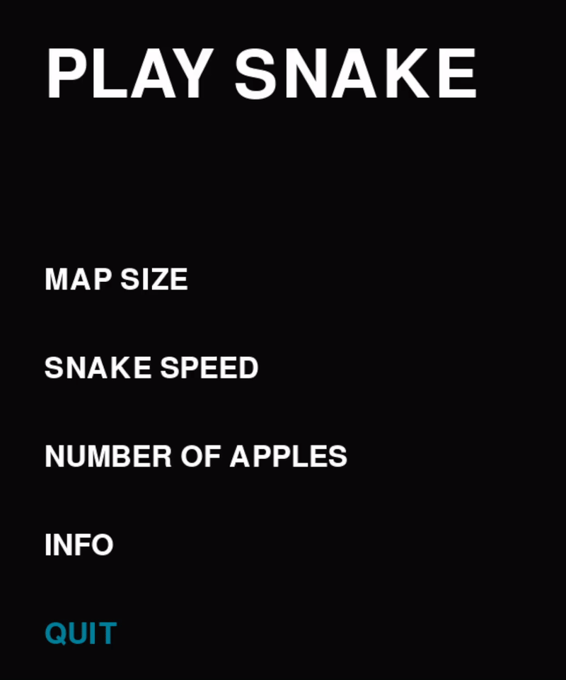

<p align="center">   </p>
<p align="center">  </p>
<p align="center">  </p>

# About
An assortment of projects that I undertook in order to learn Python:

Using Pygame:
* Chess
* Snake

Using Tkinter
* Currency Converter
* Calculator

# Building [](https://github.com/J-Afzal/Python-Projects/actions/workflows/pyinstaller.yml)
To install all the dependencies use the following command in the root directory:
```commandline
pip install -r requirements.txt
```
To compile each project into a single .exe file using the following command in the `.pyinstaller` directory:
```commandline
pyinstaller build.spec
```
The .exe files should be located in `.pyinstaller/dist/`
